https://github.com/DogGuyMan/GFM_Syntax

----------
# Git
## 1. git의 기초
**정의** : 모든 파일 버젼을 관리하게 도와주는 오픈 소스다

git을 몰랐던 상태에서는 여러 파일의 수정본을 어떻게 관리했을까?


아마 이런식으로 관리 했었을것이다. 

하지만 위의 그림처럼 규칙 없이 이름이 마음대로 붙여진경우 어떤것이 수정되었는지 알수가 없다

스냅샷이라는 데이터 처리로 저용량으로 빠르고 간편하게 버젼관리를 할 수 있다.

----------
## 2. git의 "상태"

세 가지 상태
Git은 파일을 Committed, Modified, Staged 이렇게 세 가지 상태로 관리한다.

1. Committed<br>
데이터가 로컬 데이터베이스에 안전하게 저장됐다는 것을 의미한다.
Git 디렉토리에 있는 파일들은 Committed 상태이다. 

2. Modified<br> 수정한 파일을 아직 로컬 데이터베이스에 커밋하지 않은 것을 말한다.
<br>아직 Staging Area에 추가하지 않았으면 Modified이다.

3. Staged<br> 
현재 수정한 파일을 곧 커밋할 것이라고 표시한 상태를 의미한다.<br>파일을 수정하고 Staging Area에 추가했다면 Staged이다.

----------
## 3. git의 단계


Git이 하는 일은
1. 워킹 트리에서 파일을 수정한다. 워킹 트리는 프로젝트의 특정 버전을 Checkout 한 것이다. 

2. Staging Area에 파일을 Stage 해서 커밋할 스냅샷을 만든다. 모든 파일을 추가할 수도 있고 선택하여 추가할 수도 있다.

3. Staging Area에 있는 파일들을 커밋해서 Git 디렉토리에 영구적인 스냅샷으로 저장한다.

-------
## 4. 워킹 디렉토리
**워킹 디렉토리**는 모든 파일은 크게 *Tracked(관리대상임)* 와 *Untracked(관리대상이 아님)* 로 나눈다.


1. Tracked 파일은 이미 스냅샷에 포함돼 있던 파일이다. Modified(수정함) 그리고 Staged(커밋으로 저장소에 기록할) 상태 중 하나이다. 

2. Untracked 파일은 워킹 디렉토리에 있는 파일 중 스냅샷에도 Staging Area에도 포함되지 않은 파일이다. 

### **git congif**
Git의 사용 환경을 설정해 주는 명령어 이다. 한 번만 설정하면 된다. 

* 언제든지 다시 바꿀 수 있다.
    * git config라는 도구로 설정 내용을 확인하고 변경할 수 있다. Git은 이 설정에 따라 동작한다. 이때 사용하는 설정 파일은 세 가지나 된다.
    
* 계정 초기설정
    ```
    git config --global user.name [이름]
    git config --global user.email [이메일]
    ```
* 사용 환경 전부 확인
    ```
    git config --list
    ```

* 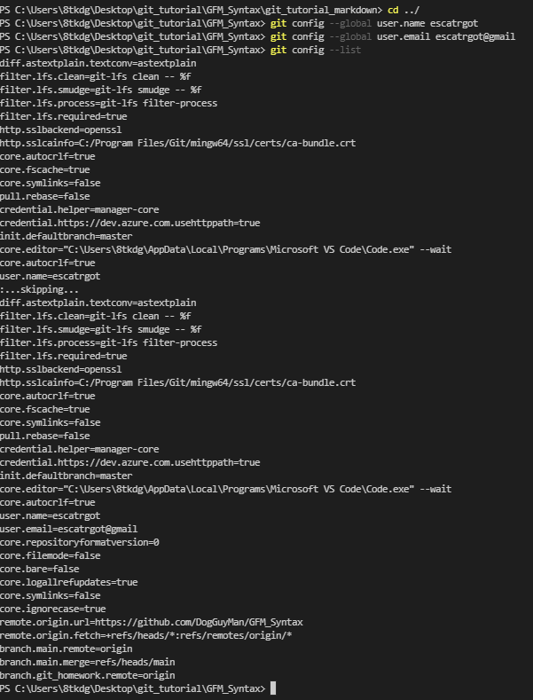

### **A. git init**


.git 이라는 하위 디렉토리를 만들고 파일의 버젼을 관리한다 
* 아직 프로젝트 파일 관리 못한다

* .git 디렉토리에는 저장소에 필요한 뼈대 파일(Skeleton)이 들어 있다.

```
git init
```


### **B .git clone [url]**


기존 저장소를 clone 하는것이다. 다른 프로젝트의 git 저장소를 복사하고싶을 떄 이 명령을 사용한다.

* Tracked이면서 Unmodified 상태이다. 

```
git clone [url "깃허브 주소"]
```

### **C. git add [옵션]**
파일을 stage상태로 전환한다. 
그렇게 함으로 commit 준비상태가 된다

꼭! commit 전에 방금 수정사항들을 저장한 이후에 실행되어야 하는 명령어이다

[옵션] 심볼로 add할 부분을 설정하는등 세부적인 옵션을 정할 수 있다.

|명령어|옵션|설명|
|:--|:--|:--|
|git add .(혹 *)| . (혹 *) |현재 폴더의 모든 파일과 디렉토리, 하위 디렉토리에 든 전부를 staging area에 추가한다.|
|git add -p [<파일>]| -p |파일의 일부를 staging하기|
|git add -i |-i | 수정되고 추적되는 파일의 변경 사항 staging하기|

```
git add 
```


### **D. git log**
. Git에는 히스토리를 조회하는 명령어인 git log 가 있다.

커밋의 SHA-1 체크섬, 저자 이름, 저자 이메일, 커밋한 날짜, 커밋 메시지를 보여준다.

* 조회 키워드를 제한 할 수 있고조회 옵션을 선택 가능하다

```
git log
```

### **E. git status**
Git의 "상태" 부분을 콘솔로 확인 할 수 있다.
작업 디렉토리(working directory)와 스테이징 영역(staging area)의 상태를 확인하기 위해서 사용된다.

>* <br>
빨간색은 아직 담기지 않은 파일을 말한다 

>* 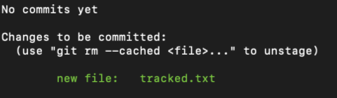<br>
> 여기서 add 를 하게 된다면 초록색으로 바뀌게 될 것이다

```
git status
```

### **F. git tag**
태그 조회하기
우선 git tag 명령으로 (-l, `--list`는 옵션) 이미 만들어진 태그가 있는지 확인할 수 있다. 


```
git tag
```

-------

## 5. GIT 디렉토리 

### **A. git commit**
수정한 것을 Staging Area에서 파일을 커밋한다. Unstaged 상태의 파일은 커밋되지 않는다

* 마치 디렉토리 전체를 복사하여 붙여넣는것과 비슷하다.

* 변경본을 전체 복사하는게 아니라 변경내역 (일명 델타라고 하는것) 을 저장한다


* commit 의 옵션도 존재한다.

|명령어|옵션|설명|
|:--|:--|:--|
|git commit -m "메세지"| -m |인라인 형식으로 바로 커밋 메세지 작성.|
|git commit -a | -a|a : 별도의 add명령어를 사용하지 않고 add, commit을 한번에 수행|
|git commit -am "메세지"|-am | a, m의 옵션을 합친 형태.|

```
git commit
```

### **B. git remote**
Push, Pull 기능으로 협업을 할때 사용되는 저장소이다. 리모트 저장소를 관리한다는 것은 저장소를 추가, 삭제하는 것뿐만 아니라 브랜치를 관리하고 추적할지 말지 등을 관리하는 것을 말한다.

1. 리모트 저장소 확인하기
git remote 명령으로 현재 프로젝트에 등록된 리모트 저장소를 확인할 수 있다.


2. 리모트 저장소 추가하기
존 워킹 디렉토리에 새 리모트 저장소를 쉽게 추가할 수 있는데 git remote add <단축이름> <url> 명령을 사용한다.

이렇게 pull push 할 저장소의 목적지를 추가했다. 

```
git remote [주소]
```

### **C. git push**
origin이라는 방금 전 리포트한 원격저장소에
 원하는 브랜치 (브랜치는 뒤에서 설명)에 푸쉬합니다.

### **D. git pull**
다른 사람이 원격 저장소(Remote repository)에 업데이트한 파일이 있을 때, 
원격저장소와 내 로컬저장소의 상태를 동일하게 만들기 위해 pull을 이용합니다.

### **E. git branch**
코드를 통째로 복사하고 나서 원래 코드와는 상관없이 독립적으로 개발을 진행할 수 있는데, 이렇게 독립적으로 개발하는 것이 브랜치다


이런식으로 색이 달라진 공간이 보인다

여기에서 추가로 더 커밋을 한다면..


여기서 알수 있는 점은

커밋을 하든 브랜치를 하던
현재 우리가 있는 위치(브랜치 위치라고 하자)가 있다. 왼쪽에서는 main이 될 수 있고 또는 newImage가 될 수 있다.


### **F. git checkout**
만약 내가 main 이 아닌 newImage를 가지고 음직이고 싶다면 어떻게 해야하는걸까?

git checkout newImage<br>(git checkout [브랜치명])

위의 명령어로 브랜치를 이동할 수 있게된다.

여기서 또 git commit을 하게된다면..


이렇게 메인이 아닌 NewImage가 commit 되었다


### **G. merge [브랜치 명]**
브랜치를 병합한다

브랜치 병합은 merge 명령어로 실행합니다. 
이 명령어에 병합할 커밋 이름을 넣어 실행하면,<br> 지정한 커밋 내용이 'HEAD'가 가리키고 있는 브랜치에 넣어진다. 

#### **HEAD란?**
head == 현재 체크아웃된 커밋
현재 작업중인 커밋이다.
HEAD는 항상 작업트리의 가장 최근 커밋을 가리킵니다.

* ^연산자로 HEAD의 부모 작업 커밋을 가르킬 수 있다.


### **H. git reset 옵션 (해시 4글자 이상)**
git 이전 기록으로 undo 하는 명령어다.
브랜치로 하여금 예전의 커밋을 가리키도록 이동시키는 방식으로 변경 내용을 되돌립니다.

* "히스토리를 고쳐쓴다"라고 말할 수 있습니다. 마치 애초에 커밋하지 않은 것처럼 예전 커밋으로 브랜치를 옮기는 것입니다.


#### **hard 옵션이란?**
--hard 옵션은 되돌리는 것이 불가능하다. 이 옵션을 사용하면 워킹 디렉토리의 파일까지 강제로 덮어쓴다. 

* ^연산자로 HEAD의 부모 작업 커밋을 가르킬 
수 있다.


이러면 로컬 저장소에는 마치 C2커밋이 아예 없었던 것과 마찬가지 상태가 됩니다.

### **I. rebase**
브랜치 끼리의 작업을 접목시키는 방법


이런 상태가 있다고 가정하자

git rebase main


main 그 다음 너머로 방금까지 있었던 브랜치가 붙어짐

---------------------
# 본격적으로 깃허브의 사용 시나리오를 보자

## 1. 시작전 변경과 기존 공간 복사

```
git clone https://github.com/DogGuyMan/GFM_Syntax
```

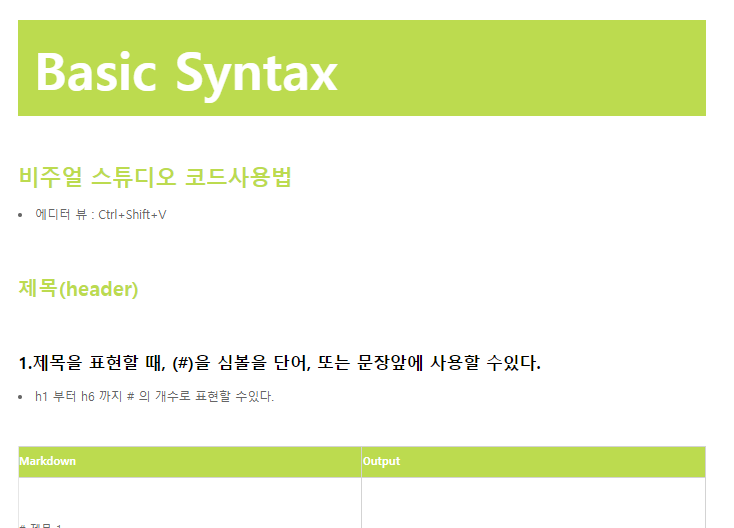<br>

저번 과제의 마크다운 파일이다
이 과제의 라임색 Css를 붉은색 검은색으로 바꿀것이다.

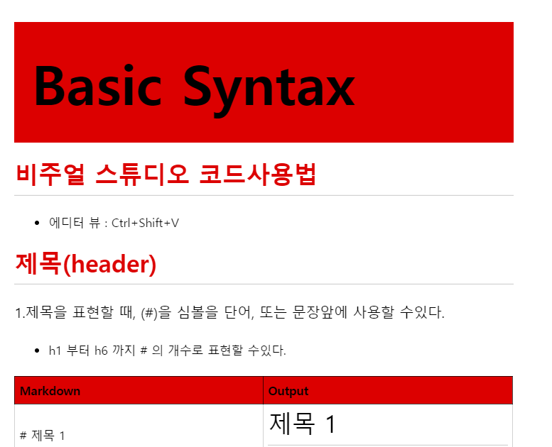<br>

## 2. 깃허브 시작
이제 깃허브에 올리기전에 
깃 설정을 한다

<br>

## 3. 깃 init
<br>

## 4. 깃 branch 그리고 상태를 확인한다
깃허브에 원본을 변경할 수 없으니
브랜치를 나눠서 따로 과제를 올리겠다.

<br>

## 5. 깃 체크아웃으로 작업 브랜치를 이동한다.
<br>

## 6. 커밋할 준비와 커밋
<br>
<br>

## 7.변경점 확인
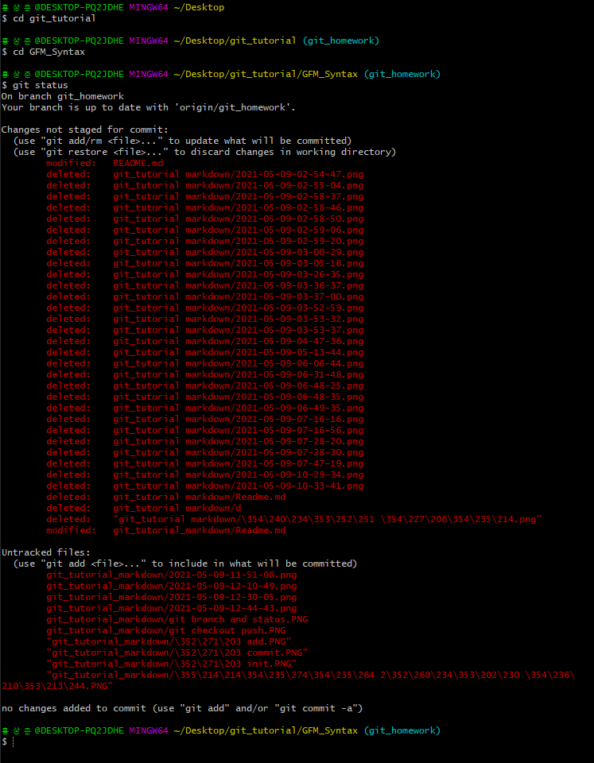

## 8.깃 로그
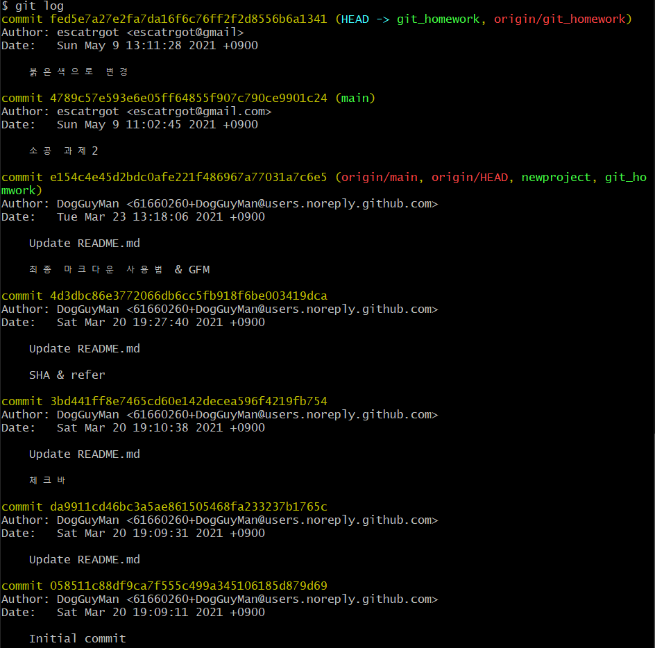

## 9.실험용으로 브랜치 만들고 삭제한다 
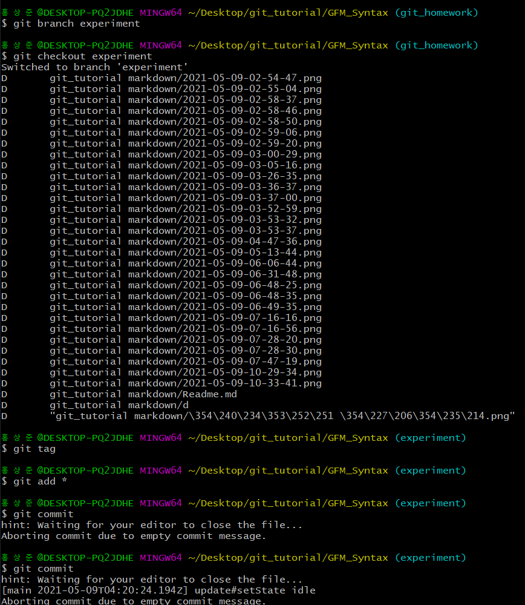

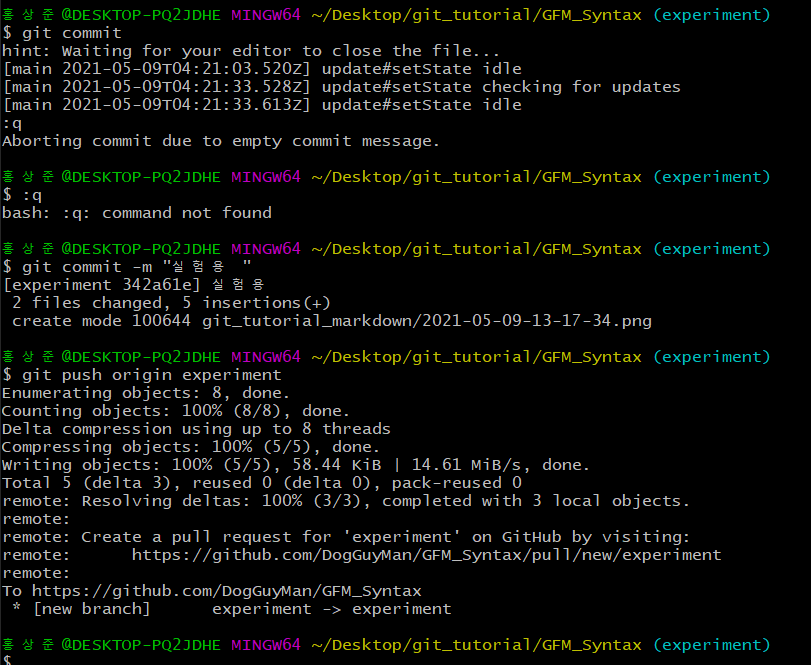

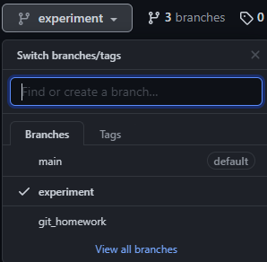

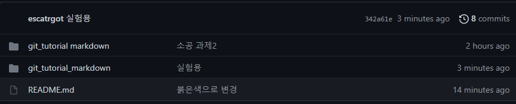

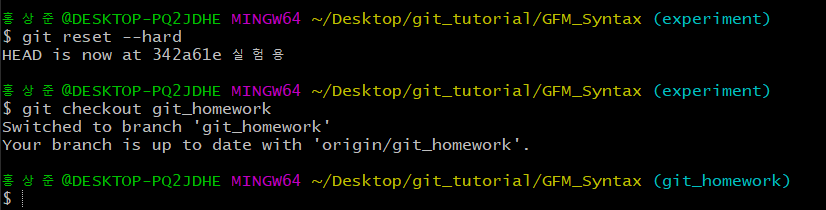